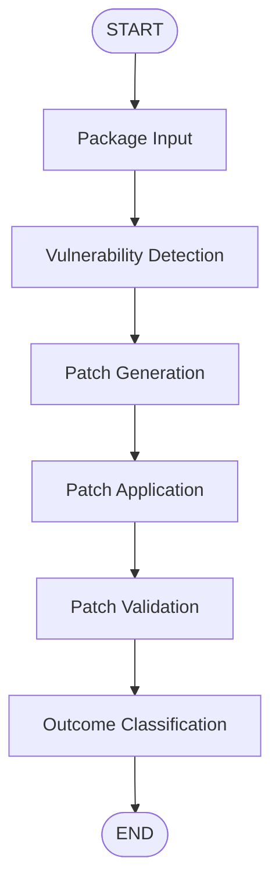

# Automated Vulnerability Detection & Patch Orchestration

An end-to-end automated security remediation pipeline built with [LangGraph](https://github.com/langchain-ai/langgraph) for orchestration, automated patch generation, validation, and outcome classification. Developed as part of the SMU Final Year Project (FYP).

---

## 📌 Overview

This project implements an agentic workflow to detect, patch, apply, and validate software vulnerabilities in target packages automatically. Using LangGraph's state graph capabilities, the pipeline breaks down security remediation into discrete, trace-able, and customizable stages. The main aim of this project is to study on the viability of current-generation LLMs to patch vulnerabilities without breaking the patch itself.

---

## 🏗 Workflow Architecture

The pipeline processes input through a sequential state graph:



### Stage Summary

1. **Package Input (`package_input_node`)**: Ingests NPM package source code.
2. **Vulnerability Detection (`vulnerability_detection_node`)**: Scans for known vulnerabilities, security flaws, or vulnerable dependencies using Syft and Grype.
3. **Patch Generation (`patch_generation_node`)**: Leverages LLMs to generate candidate security patches or code fixes.
4. **Patch Application (`patch_application_node`)**: Applies the generated patches to the target codebase in a snandbox environment.
5. **Patch Validation (`patch_validation_node`)**: Runs unit tests, security checks, dynamic and manual validation to verify patch efficacy.
6. **Outcome Classification (`outcome_classification_node`)**: Analyzes validation results and categorizes final patch status (e.g., Success, Failed Validation, Syntax Error).

---

## 📁 Repository Structure

```
.
├── graph.py                   # Main LangGraph workflow definition & state graph compilation
├── package_input.py           # Node implementation for package input processing
├── vulnerability_detection.py  # Node implementation for vulnerability scanning
├── patch_generation.py        # Node implementation for LLM patch generation
├── patch_application.py       # Node implementation for applying patches
├── patch_validation.py        # Node implementation for patch validation & testing
├── outcome_classification.py  # Node implementation for classifying final outcomes
├── langgraph.json             # LangGraph server configuration
├── requirements.txt           # Python dependencies
└── README.md                  # Project documentation
```

---

## 🚀 Getting Started

### Prerequisites

- Python 3.10+
- `pip` package manager

### 1. Installation

Clone the repository and set up a virtual environment:

```bash
git clone https://github.com/shirosensei02/FYP.git
cd FYP

# Create and activate virtual environment
python -m venv .venv
# On Windows PowerShell:
.\.venv\Scripts\Activate.ps1
# On Linux/macOS:
source .venv/bin/activate

# Install dependencies
pip install -r requirements.txt
```

### 2. Environment Configuration

Create a `.env` file in the root directory for any environment variables or API keys (e.g., OpenAI / Anthropic keys):

```env
# .env
OPENAI_API_KEY=your_api_key_here
```

---

## 🧪 Running Locally with LangGraph Studio

Launch the local in-memory dev server and Studio UI:

```bash
langgraph dev
```

Once started, access the server resources:

- 🎨 **LangGraph Studio UI**: [https://smith.langchain.com/studio/?baseUrl=http://127.0.0.1:2024](https://smith.langchain.com/studio/?baseUrl=http://127.0.0.1:2024)
- 🚀 **API Base URL**: `http://127.0.0.1:2024`
- 📚 **Interactive API Docs**: `http://127.0.0.1:2024/docs`

---

## 🛠 Tech Stack

- **Framework**: [LangGraph](https://langchain-ai.github.io/langgraph/) & [LangChain Core](https://github.com/langchain-ai/langchain)
- **Runtime & CLI**: `langgraph-cli[inmem]`
- **Environment**: Python `dotenv`
