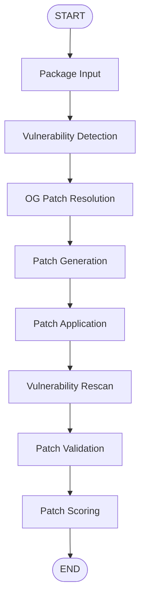

# Automated Vulnerability Detection & Patch Orchestration

An end-to-end automated security remediation pipeline built with [LangGraph](https://github.com/langchain-ai/langgraph) for orchestration, automated patch generation, validation, and outcome classification. Developed as part of the SMU Final Year Project (FYP).

---

## 📌 Overview

This project implements an agentic workflow to detect, patch, apply, and validate software vulnerabilities in target packages automatically. Using LangGraph's state graph capabilities, the pipeline breaks down security remediation into discrete, trace-able, and customizable stages. The main aim of this project is to study on the viability of current-generation LLMs to patch vulnerabilities without breaking the patch itself.

---

## 🏗 Workflow Architecture

The pipeline processes input through a sequential state graph:



### Stage Summary

1. **Package Input (`package_input_node`)**: Ingests NPM package source code.
2. **Vulnerability Detection (`vulnerability_detection_node`)**: Scans for known vulnerabilities, security flaws, or vulnerable dependencies using Syft and Grype.
3. **OG Patch Resolution (`og_patch_resolution_node`)**: Looks up the GitHub Advisory for the finding and, if a patch commit exists, records that official answer-key patch. Not fed into generation.
4. **Patch Generation (`patch_generation_node`)**: Leverages LLMs to generate candidate security patches or code fixes.
5. **Patch Application (`patch_application_node`)**: Applies the generated patches to the target codebase in a sandbox environment.
6. **Vulnerability Rescan (`vulnerability_rescan_node`)**: Re-scans the patched package for the original findings.
7. **Patch Validation (`patch_validation_node`)**: Classifies pass/fail from build, tests, and re-scan.
8. **Patch Scoring (`patch_scoring_node`)**: Compares the generated patch to the GitHub Advisory maintainer patch on location (same / overlapping / different), strategy (same / similar / different), and completeness (full / partial / none). Does not change pass/fail.

---

## 📁 Repository Structure

```
.
├── graph.py                   # Main LangGraph workflow definition & state graph compilation
├── package_input.py           # Node implementation for package input processing
├── vulnerability_detection.py  # Node implementation for vulnerability scanning
├── og_patch_resolution.py     # Official GitHub Advisory / answer-key lookup
├── patch_generation.py        # Node implementation for LLM patch generation
├── patch_application.py       # Node implementation for applying patches
├── vulnerability_rescan.py    # Post-patch Grype re-scan
├── patch_validation.py        # Node implementation for patch validation & testing
├── patch_scoring.py           # Maintainer-fix comparison: location, strategy, completeness
├── config/models.json          # OpenRouter models used for patch generation
├── prompts/baseline.txt        # Security patch-generation prompt
├── langgraph.json             # LangGraph server configuration
├── requirements.txt           # Python dependencies
└── README.md                  # Project documentation
```

---

## 🚀 Getting Started

### Prerequisites

- Python 3.10+
- `pip` package manager

### 1. Installation

Clone the repository and set up a virtual environment:

```bash
git clone https://github.com/shirosensei02/FYP.git
cd FYP

# Create and activate virtual environment
python -m venv .venv
# On Windows PowerShell:
.\.venv\Scripts\Activate.ps1
# On Linux/macOS:
source .venv/bin/activate

# Install dependencies
pip install -r requirements.txt
```

### 2. Environment Configuration

Create a `.env` file in the root directory for API keys and the MongoDB connection URI:

```env
# .env
OPENAI_API_KEY=your_api_key_here
ANTHROPIC_API_KEY=your_api_key_here
GEMINI_API_KEY=your_api_key_here
OPENROUTER_API_KEY=your_openrouter_api_key_here
# Optional: use a compatible OpenRouter endpoint
OPENROUTER_BASE_URL=https://openrouter.ai/api/v1
MONGO_URI=your_mongodb_connection_uri_here
```

---

## 🧪 Running Locally with LangGraph Studio

Launch the local in-memory dev server and Studio UI:

```bash
langgraph dev
```

Once started, access the server resources:

- 🎨 **LangGraph Studio UI**: [https://smith.langchain.com/studio/?baseUrl=http://127.0.0.1:2024](https://smith.langchain.com/studio/?baseUrl=http://127.0.0.1:2024)
- 🚀 **API Base URL**: `http://127.0.0.1:2024`
- 📚 **Interactive API Docs**: `http://127.0.0.1:2024/docs`

---

## 🧪 Testing the Pipeline Locally

`test_local_pipeline.py` provides a lightweight, end-to-end test runner that executes all five pipeline nodes in sequence without needing a LangGraph server. It uses the deterministic `mock` provider by default, or an API-backed provider when selected with `--model-provider` and `--model-name`.

For live patch generation, the pipeline supports OpenRouter through the OpenAI-compatible API. The configured free models are listed in `config/models.json`; pass any model ID from that file with `--model-name`.

```bash
OPENROUTER_API_KEY=your_openrouter_api_key_here \
python run_live_pipeline.py \
  --package-name semver \
  --package-version 7.5.1 \
  --model-provider openrouter \
  --model-name nvidia/nemotron-3-super-120b-a12b:free
```

`run_live_pipeline.py` executes the complete LangGraph flow, including Docker
validation. Every terminal outcome is stored in `fyp_patches.all_attempts`;
patches that pass Docker build and package validation are additionally stored
in `fyp_patches.successful_patches`.

### Prerequisites

| Tool | Required for |
|------|-------------|
| `npm` | Downloading & packing the target package (Node 1) |
| [`syft`](https://github.com/anchore/syft) + [`grype`](https://github.com/anchore/grype) | Real vulnerability scanning (Node 2) |
| [Docker](https://www.docker.com/) | Sandbox patch application (Node 4) |

> **Note:** All three external tools can be bypassed using the flags below — only Python and the project dependencies are strictly required.

### CLI Flags

| Flag | Description |
|------|-------------|
| `--package-name` | *(required)* NPM package name to test |
| `--package-version` | *(required)* Package version to test |
| `--model-provider` | Patch provider; use `openrouter` for an OpenRouter model (default: `mock`) |
| `--model-name` | Provider-specific model ID, such as an ID from `config/models.json` |
| `--patch-scope` | `single` (default) or `all` — how many vulns to patch |
| `--source-dir` | Path to a pre-extracted source directory — skips `npm pack` + extract |
| `--skip-vuln-detection` | Inject a mock vulnerability instead of running `syft`/`grype`/`npm audit` |
| `--stop-after-patch` | Skip Docker validation and MongoDB persistence after patch generation |
| `--dump-state` | Print the full pipeline state dict at the end |

### Usage Examples

**Quickest run — no external tools needed:**
```bash
python test_local_pipeline.py \
  --package-name lodash \
  --package-version 4.17.15 \
  --skip-vuln-detection
```

**Full flow (requires `npm`, `syft`, `grype`, and Docker):**
```bash
python test_local_pipeline.py \
  --package-name lodash \
  --package-version 4.17.15
```

**Test an OpenRouter model locally:**

Set `OPENROUTER_API_KEY` in `.env` or export it in your shell. Use a model ID
from `config/models.json`; the example below uses the configured Nemotron
model. This runs detection, patch generation, Docker validation, and persists
the result to MongoDB only if validation passes.

```bash
python test_local_pipeline.py \
  --package-name ip \
  --package-version 2.0.1 \
  --model-provider openrouter \
  --model-name nvidia/nemotron-3-super-120b-a12b:free
```

To test the configured Gemma model, replace only `--model-name`:

```bash
--model-name google/gemma-4-31b-it:free
```

Use `--stop-after-patch` when you want to inspect only the model response and
skip Docker validation and MongoDB persistence. Do not use
`--skip-vuln-detection` for a real package-patching evaluation: it injects a
mock vulnerability rather than the package's scanner finding.

**Use a pre-extracted source directory (skips `npm pack` + extract):**
```bash
python test_local_pipeline.py \
  --package-name lodash \
  --package-version 4.17.15 \
  --source-dir ".workspace/packages/lodash/4.17.15/source/package" \
  --skip-vuln-detection
```

**Dump the full state at the end for debugging:**
```bash
python test_local_pipeline.py \
  --package-name semver \
  --package-version 7.5.1 \
  --skip-vuln-detection \
  --dump-state
```

### What to Expect

The runner prints a clear separator for each stage and a final summary:

```
============================================================
  NODE 1 / 5 - PACKAGE INPUT
============================================================
  source_dir : .workspace/packages/lodash/...
  tarball    : .workspace/packages/lodash/...

...

============================================================
  PIPELINE COMPLETE
============================================================
  package            : lodash@4.17.15
  classification     : ...
  sandbox_success    : True
  errors             : []
```

---

## 🛠 Tech Stack

- **Framework**: [LangGraph](https://langchain-ai.github.io/langgraph/) & [LangChain Core](https://github.com/langchain-ai/langchain)
- **Runtime & CLI**: `langgraph-cli[inmem]`
- **Environment**: Python `dotenv`
